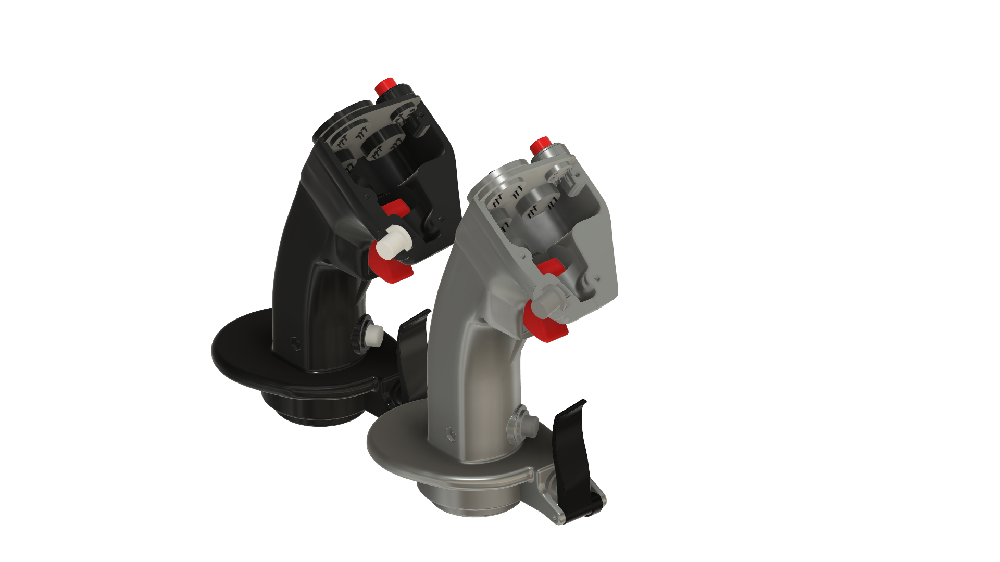

# 3D-printed HOTAS Joystick Soleil: F-16 Sticks + housing + twist rudder controls

## Features:
- Removable stick
- Two different stick's size, improved stick's parts mounting, used other type of 5-way Hat/POV Switches
- Improved Gimbal parts mounting, corrected the dimensions of the holes for the bearings
- Two different types of housing, one with additional axes and toggles

## 3D Model
You can see the assembled 3D models in web:
- [Short Size Stick](https://a360.co/3PqR6vJ)

- [Normal Size Stick](https://a360.co/3PvqF8i)

- [Cylindrical JoyStick Base](https://a360.co/3Li3Hh7)

- [Rectangular JoyStick Base](https://a360.co/3q2hyS1)

## Printing
- White and black PLA+, red PET-G
- Rafts: Yes
- Supports: Yes
- Infill: 20 - 30 - 60%
 
## Components (not complete)
- Bearing 6802zz (15x24x5mm) - 5 units
- Bearing MF105zz - 8 units
- Bearing 685zz - 4 units
- Adhesive non-slip pad 200x200mm - 1 init
- The TLE5011/5010 sensors - 2 units
- Hall-effect sensor (SS49E for example) - 1 unit
- Ceramic capacitor 50V 104 100nF 0.1uf - 1 unit
- Cylindrical magnets (5x10mm) - 4 units
- 5-Way Switch 10x10x10mm Multi Direction Switch Touch Reset Button - 4 units
- Push Button 6x6 4.3mm - 5 units
- Miniature toggle switch (on/of/on or reset/of/reset ) - 2 units
- Potentiometer (WH148) 10K Ohm (B10K) - 3 units
- Switching Diode (for example 1N4148) - 30 units
- Micro-USB 5pin Micro USB 2.0 Male to USB 2.0 B Type Female Connector Cable 30cm With Panel Mount Hole cables - 1 unit
- Wires - 28-32 AWG 
- Hot Glue - 1 unit
- Two Component Epoxy Glue or Super Glue- 1 unit
- Low-cost STM32F103C8 microcontroller - 1 unit
- [FreeJoy soft and manual](https://github.com/FreeJoy-Team/FreeJoyWiki)

### Screws, nuts, etc…
- WiP - [See the answer to the issue](https://github.com/Miramaksimus/HOTAS-Joystick-Soleil/issues/3#issuecomment-2561463725)

##  Images

##  Video

## **If you find this design helpful, consider  to support my work and my future projects. Thanks in advance.**
