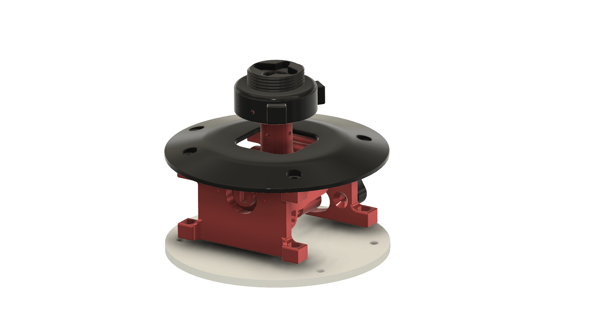

# 3D-printed HOTAS Joystick Soleil: F-16 Sticks + housing + twist rudder controls

## Features:
- Removable stick
- Two difаerent stick's size, improved stick's parts mounting, used other type of 5-way Hat/POV Switches
- Improved Gimbal parts mounting, corrected the dimensions of the holes for the bearings
- Two difаerent types of housing, one with additional axes and toggles

## 3D Model
You can see assembled 3D model in [this URL](https://a360.co/3Li3Hh7)

## Printing
- White and black PLA+, red PTEG
- Rafts: Yes
- Supports: Yes
- Infill: 30 - 60%
 
## Components (not complete)
- Bearing  (10x22x6mm)  - 5 units
- Adhesive non-slip pad 200x200mm - 1 init
- Hall-effect sensor (SS49E for example) - 1 units
- Ceramic capacitor 50V 104 100nF 0.1uf - 1 units
- Cilindrical magnets (5x10mm) - 2 units
- 5-Way Switch 10x10x10mm Multi Direction Switch Touch Reset Button - 3 units
- Push Button 6x6 4.3mm - 5 units
- Miniature toggle switch- on/of/on - 5 units
- Potentiometer (WH148) 10K Ohm (B10K) - 2 units
- Switching Diode (for example 1N4148) - 30 units
- Micro-USB 5pin Micro USB 2.0 Male to USB 2.0 B Type Female Connector Cable 30cm With Panel Mount Hole cables - 1 unit
- Wires - 28-32 AWG 
- Hot Glue - 1 unit
- Two Component Epoxy Glue or Super Glue- 1 unit
- Low-cost STM32F103C8 microcontroller - 1 unit
- [FreeJoy soft and manual](https://github.com/FreeJoy-Team/FreeJoyWiki)

### Screws, nuts, etc…
- WiP

##  Images

##  Video

## **If you find this design helpful, consider  to support my work and my future projects. Thanks in advance.**
